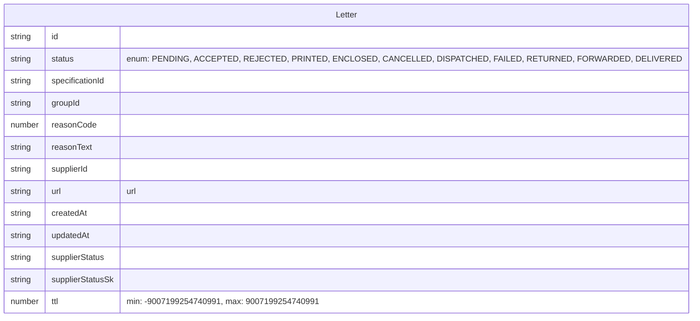
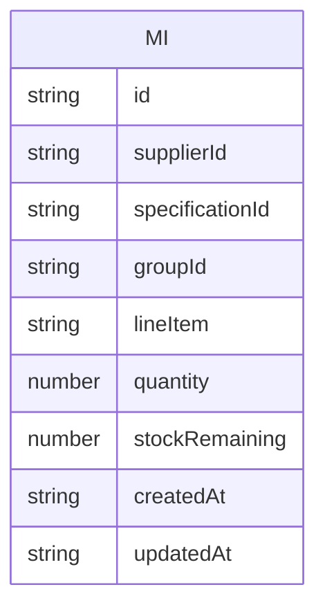
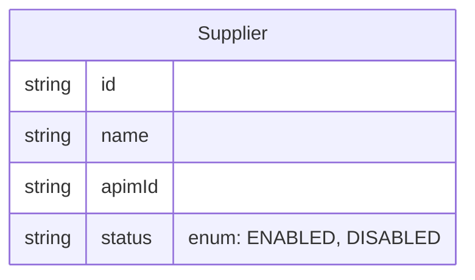

# Data Store Schemas

This document contains the mermaid diagrams for the data store schemas used in the application.

The schemas are generated from Zod definitions and provide a visual representation of the data structure.

## Letter schema

## MI schema

## Supplier schema

