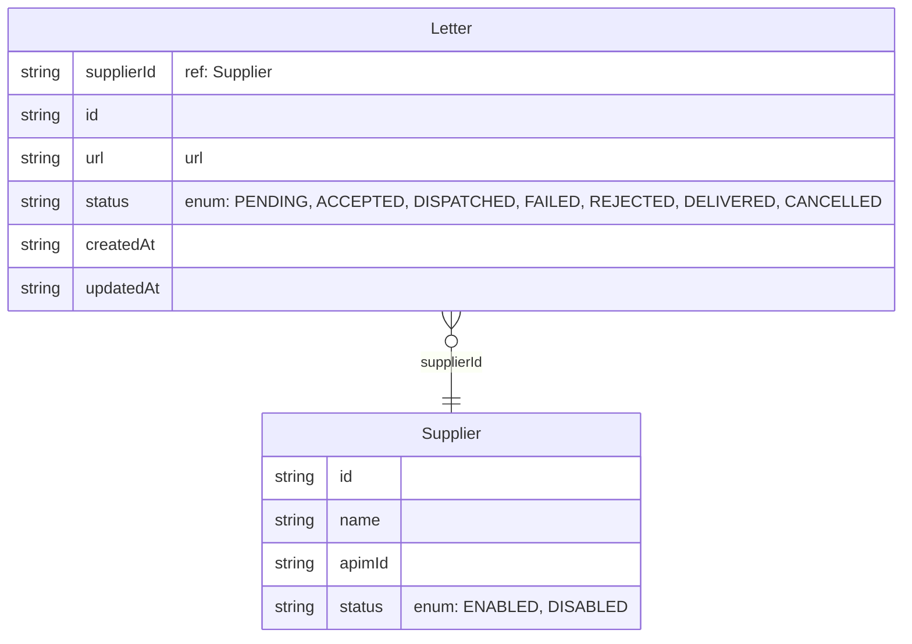

# Letter schema

```mermaid
erDiagram
    Letter {
        string supplierId "ref: Supplier"
        string id
        string url "url"
        string status "enum: PENDING, ACCEPTED, DISPATCHED, FAILED, REJECTED, DELIVERED, CANCELLED"
        string createdAt
        string updatedAt
    }
    Supplier {
    }
    Supplier {
        string id
        string name
        string apimId
        string status "enum: ENABLED, DISABLED"
    }
    Letter }o--|| Supplier : "supplierId"
```
